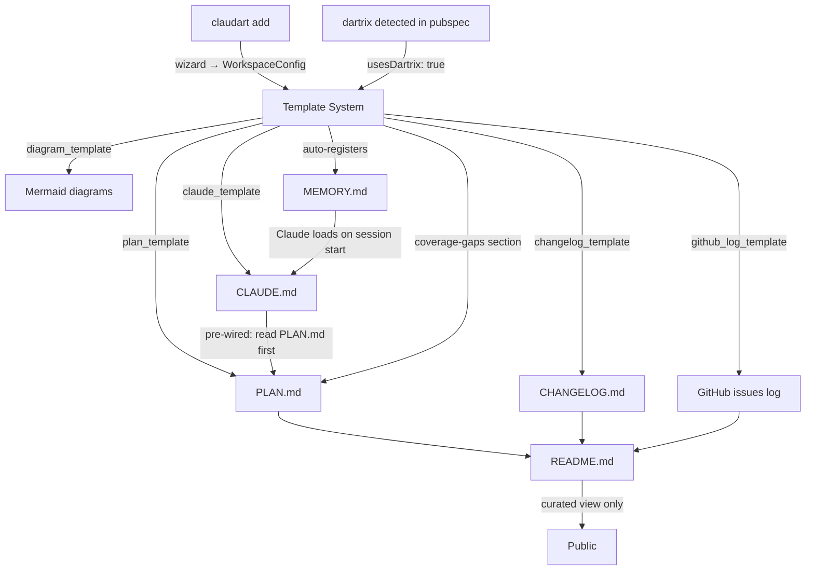
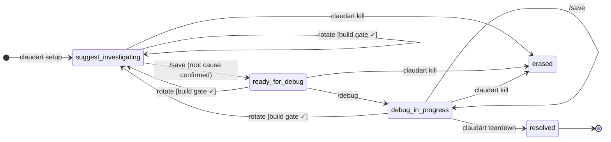
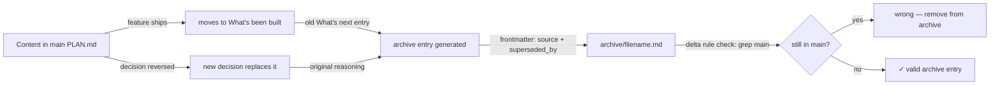

# claudart — plan

This file is the never-lose-context document for claudart.
README.md = current public API (curated view). CHANGELOG.md = version history. PLAN.md = vision + reasoning + where we are.
docs/design.md = formal session state machine (FSA). docs/session_log.md = design decision record.

---

## Vision

claudart is the **AI agent workflow layer** for software projects — and the **workspace scaffolding
system** that gives every project a consistent, self-describing context structure.

Two complementary tools:
- **claudart** — session orchestration (setup → suggest → save → debug → teardown)
- **zedup** — work management (profiles, branches, dashboard, registry)

claudart works on branches. zedup manages them. They share the same registry.



The end state:
```
claudart add     → wizard: configure workspace, generate markdown triple, register in MEMORY.md
claudart setup   → initialize session, write handoff
/suggest         → investigate, write root cause to handoff
/save            → checkpoint + transition to ready-for-debug
/debug           → implement fix, tests must pass before done
claudart teardown → archive handoff, promote to skills
```

---

## Architecture principles

**The session IS a deterministic finite automaton.**
Every command is a transition. Every state is an enum variant. Missing transitions are compile errors,
not runtime surprises. See `docs/design.md` for the formal proof.

**The handoff file is the session.** It survives terminal kills, context limits, and model
switches. The terminal process is ephemeral; the handoff is not. This is why suggest → save →
debug requires the save step — it externalizes state before crossing a session boundary.

**Templates are the source of truth. Documents are rendered views.**
Every markdown file (PLAN.md, CLAUDE.md, README sections, diagrams, changelogs) is
generated from a template. No information lives only in a rendered document — it lives in
the template that generated it. README.md is always derivable; it is never the origin.

**Self-hosting law.** claudart must be able to debug its own bugs using its own workflow.
If a claudart session can't be run with `claudart setup` on the claudart repo, the tool is
broken. Every architecture decision is tested against this law.

**Injectable I/O everywhere.** No hardcoded stdin/stdout in lib/. Every interactive component
has an injected interface so tests can simulate input without a TTY. This is non-negotiable.

---

## Template system

### What templates are

Templates are Dart functions in `lib/templates/` that take a `WorkspaceConfig` struct and
return a markdown string. They are pure — no I/O, no side effects. They can be unit tested
in isolation. They are the source of truth for every document claudart generates.

```
lib/templates/
  plan_template.dart         → PLAN.md for a workspace
  claude_template.dart       → CLAUDE.md (context window) for a workspace
  changelog_template.dart    → CHANGELOG.md structure + entry format
  diagram_template.dart      → Mermaid diagrams (architecture, state machines, dependency graphs)
  readme_section_template.dart → README.md sections (planned, built, philosophy)
  github_log_template.dart   → GitHub issues log section in PLAN.md
```

### WorkspaceConfig — the configuration struct

Generated by the `claudart add` wizard. Answers drive what gets generated:

```dart
class WorkspaceConfig {
  final String projectName;
  final String gitAuthorName;
  final String gitAuthorEmail;
  final String dartSdkConstraint;
  final bool usesDartrix;       // → injects coverage-gaps section into PLAN.md
  final bool githubTracking;    // → injects issues log + planned table into PLAN.md + README
  final bool mermaidDiagrams;   // → injects architecture diagram into PLAN.md
  final bool changelogEnabled;  // → generates CHANGELOG.md with version entry format
  final ProjectType projectType; // cli, library, tui, flutter — shapes the profile in CLAUDE.md
}
```

### Feature lifecycle — from idea to public README

Every feature follows the same lifecycle through templates:

```
1. PLAN.md section   ← "what's next" entry + Mermaid diagram (if mermaidDiagrams: true)
2. GitHub issue      ← if githubTracking: true, PLAN.md links to issue number
3. Implementation    ← code
4. CHANGELOG entry   ← version-tagged, links back to issue
5. README section    ← curated public description, derived from PLAN + CHANGELOG context
```

No information exists only in README. README is always the last stop, never the origin.
This means migrating README.md to a new format never loses anything — the source is always
in PLAN.md or the template that generated the README section.

### Diagram templates

Every feature that has a state machine, dependency graph, or data flow gets a Mermaid diagram.
Diagrams live in PLAN.md next to the feature they describe — not in a separate diagrams/ folder.
When a feature moves from "what's next" to "what's built", the diagram moves with it.

```
State machines    → stateDiagram-v2  (session DFA, feature flows)
Dependency graphs → graph LR         (package relationships, module deps)
Data flows        → sequenceDiagram  (claudart add wizard, suggest → debug flow)
Architecture      → graph TD         (workspace layout, tool relationships)
```

GitHub renders Mermaid as interactive SVG. The diagram in PLAN.md IS the diagram in the
GitHub view — no separate tooling needed.

### GitHub tracking section (optional, config-driven)

When `githubTracking: true`, PLAN.md gets a "GitHub issues" section that maps planned work
to issue numbers. README.md gets a "Planned" table that links to those issues. The
CHANGELOG.md format includes `(#N)` references on every entry.

This section is generated once and then maintained by hand — it's a living log, not
re-generated on every `claudart add` run.

---

## Workspace scaffold — `claudart add` wizard

When `claudart add` runs in a project directory, it:

1. **Reads git config** — author name + email pre-filled
2. **Asks configuration questions** — one at a time, minimal, confirmable:
   ```
   Project name: [detected from git]
   Dart SDK: >=3.5.0 <5.0.0
   Uses dartrix? [y/n]
   GitHub issue tracking? [y/n]
   Mermaid diagrams in PLAN.md? [y/n]
   CHANGELOG.md? [y/n]
   Project type? [cli / library / tui / flutter]
   ```
3. **Generates the markdown triple** from templates into `~/.claudart/<project>/`:
   ```
   PLAN.md    ← vision stub + configured sections
   CLAUDE.md  ← pre-wired context window (profile + "read PLAN.md first" + constraints)
   ```
4. **Registers in MEMORY.md** — writes workspace pointer to Claude Code's auto-memory
   at `~/.claude/projects/<hash>/memory/` so Claude immediately knows this project exists
5. **Links the workspace** — `.claude/` symlink into project root

The generated CLAUDE.md has `read PLAN.md first` hardcoded to the workspace path.
The generated PLAN.md has the configured sections already present as stubs.
The developer fills in the stubs — claudart provides the structure.

### What re-running `claudart add` does

Re-running is safe. It regenerates only the environment sections of CLAUDE.md (SDK constraints,
paths, git rules). It never overwrites content the developer has written into PLAN.md stubs.
The profile section of CLAUDE.md is preserved — it is not re-generated.

---

## Relationship to zedup and dartrix

**dartrix:** claudart detects dartrix in `pubspec.yaml` and injects a coverage-gaps section into
the generated PLAN.md. The section explains: "enum variants that haven't been exercised in
each feature appear here as named failures from `matrix.gaps()`." claudart doesn't run the
matrix — it just gives PLAN.md the right structure to track it.

**zedup:** claudart reads `zedup.md` as a memory artifact — the formal enum taxonomy for zedup's
domain. When claudart sessions target zedup or dartrix, the handoff should include the relevant
enum context so Claude understands the typed model without re-reading source files each time.

**Delegation of integrity:**

| Concern | Owner | Mechanism |
|---------|-------|-----------|
| Dart test coverage enforcement | dartrix | Compile-time exhaustive switch — new enum variant without `features` update = compile error |
| Session workflow correctness | claudart | DFA state machine — invalid transitions don't compile |
| Workspace context window | claudart (generated) | CLAUDE.md, pre-wired to PLAN.md, generated by `claudart add` |
| Product logic | zedup | Enum-driven TUI, proven patterns promoted to dartrix |
| Public documentation | README.md | Curated view derived from PLAN.md — never the origin |

---

## What's been built

### v1 — Core workflow (complete)
- `claudart setup` — per-session initialization, handoff.md written
- `/suggest` → `/save` → `/debug` handshake enforced
- `HandoffStatus` enum with exhaustive switches — state machine correct
- `claudart teardown` — archive + skills promotion
- `claudart kill` — emergency reset
- Self-hosting validated — claudart has debugged its own bugs



### v2 — Registry-based workspace model (in progress)
Moving from single global workspace to per-project workspaces:

```
~/.claudart/
  registry.json          ← startup reads ONLY this
  dc-flutter/
    config.json          ← loaded after project selected
    handoff.md
    skills.md
    archive/
    knowledge/
    PLAN.md              ← generated by claudart add, owned by project
    CLAUDE.md            ← generated by claudart add, re-generatable
```

**Why:** Current single-workspace model is fragile — string matching on CLAUDE.md, no per-project
isolation, manual `claudart link` required, CLAUDE.md bleeds into project root.

**Key changes:**
- `paths.dart`: `claudeDir → workspaceFor(projectName)`
- `launch.dart`: Phase 1 registry read, Phase 2 workspace load on selection
- `link.dart`: `.claude` symlink only (no CLAUDE.md symlink), writes .gitignore entries
- `_isLinked`: reads registry + checks symlink (no CLAUDE.md string matching)

### Prototype templates (proven manually, not yet in code)
- dartrix `CLAUDE.md` + zedup `CLAUDE.md` + claudart `CLAUDE.md` — hand-written this session
  as reference implementations for what `claude_template.dart` should generate
- dartrix `PLAN.md` + zedup `PLAN.md` + claudart `PLAN.md` — hand-written reference implementations
  for what `plan_template.dart` should generate (with and without dartrix section)

These files are the spec for the template system. The template system is what generates them
automatically for the next project.

---

## What's next

### Phase 1 — Finish v2 migration (unblocks everything else)
- `setup.dart`: registry-based workspace paths, drop legacy path assumptions (todo #6)
- `teardown.dart`: same migration (todo #7)

### Phase 2 — Template system (pure Dart, zero regression risk)
- `WorkspaceConfig` struct — the configuration model
- `lib/templates/plan_template.dart` — PLAN.md generator with conditional sections
- `lib/templates/claude_template.dart` — CLAUDE.md generator with profile + pre-wired paths
- `lib/templates/diagram_template.dart` — Mermaid string generators per diagram type
- `lib/templates/changelog_template.dart` — CHANGELOG entry format
- `lib/templates/github_log_template.dart` — GitHub issues log section
- Unit tests for each template (pure functions — no I/O mocking needed)

### Phase 3 — `claudart add` wizard
- Configuration questions flow (injectable for tests)
- Generates markdown triple from templates → writes to workspace
- Registers workspace in Claude Code's MEMORY.md
- Detects dartrix in `pubspec.yaml` → sets `usesDartrix: true` automatically

### Phase 4 — UX improvements
- `skills.md` Pending: keyed map structure (slug → root cause/status)
- Premium interactive CLI: arrow-key menus, spinner, status bar
- Teardown prompts: distill to one-liners
- `claudart resume` — pre-populate setup from most recent archive

### Phase 5 — README migration
Once templates are built: migrate all three READMEs (claudart, dartrix, zedup) to be
generated from their PLAN.md content. README becomes a curated render — no information loss,
cleaner public surface.

---

## GitHub archive convention

Every repo using claudart's template system gets an `archive/` folder in the repo root,
committed to main. It is a **delta record only** — it contains exclusively content that has
been removed from main documents. It never duplicates anything currently in main.

### The delta rule

> If the content still exists anywhere in any current document on main, it does not belong
> in archive. Archive only holds what main dropped.

This is enforceable by inspection: if you can find the content by grepping main, the archive
entry is wrong.

### Archive entry format

Each entry is a single markdown file. The frontmatter declares the delta explicitly:

```markdown
---
archived: YYYY-MM-DD
source: <file> § <section heading>
superseded_by: <what replaced it, or "shipped" if the feature completed>
---

[exact content that was removed — nothing added, nothing paraphrased]
```

If `superseded_by` cannot be filled in, the content is not ready to be archived — it still
belongs in main.

### What gets archived

| Content type | Archive when |
|---|---|
| PLAN.md "what's next" section | Feature shipped → moves to "what's built" → old entry archived |
| PLAN.md design decision | Decision reversed → new decision added → original reasoning archived |
| README section | Section removed or consolidated → exact removed text archived |
| CHANGELOG entry | Entry reformatted/consolidated → original wording archived |
| Deprecated experiment | Superseded by a confirmed design → experiment archived |

### What does NOT get archived

- Content that still exists in main (in any form)
- Git history (that's what `git log` is for)
- Handoff/session snapshots (those go in `~/.claudart/<project>/archive/`, not GitHub)
- Speculative ideas that were never in a document (they were never in main to begin with)

### Template support

`lib/templates/archive_entry_template.dart` generates the frontmatter + wraps the removed
content. `claudart add` creates the `archive/` directory (empty, with a `.gitkeep` and a
`README.md` stub explaining the delta rule) as part of workspace scaffold.

When `claudart teardown` or a future `claudart archive` command runs, it can assist in
generating archive entries from removed content — but never automatically. The developer
confirms what's being archived and what superseded it.



---

## Key decisions log

| Decision | Why |
|----------|-----|
| Session state is a DFA | Exhaustive enum switch = compile-time transition enforcement; missing cases don't compile |
| save is required between suggest and debug | Externalizes state before crossing session boundary; ensures handoff is the truth |
| handoff.md is the session, not the process | Terminal process is ephemeral; handoff survives kills, context limits, model switches |
| Injectable I/O everywhere in lib/ | No hardcoded stdin/stdout — interactive components must be testable without a TTY |
| Self-hosting law | If claudart can't debug its own bugs with its own workflow, the tool is broken |
| Per-project workspaces (v2) | Single global workspace had string-matching fragility and no project isolation |
| Templates are source of truth | No information lives only in a rendered document; README is always derivable, never the origin |
| Diagrams live in PLAN.md, not a diagrams/ folder | Diagram travels with the feature it describes; GitHub renders Mermaid as SVG |
| claudart add wizard drives generation | Config questions → WorkspaceConfig → templates → markdown triple; DRY across all projects |
| MEMORY.md auto-registration on add | Claude immediately knows the workspace exists; no manual MEMORY.md editing per project |
| dartrix is a pure Dart package, not a markdown generator | claudart generates the dartrix-aware sections; dartrix's responsibility is compile-time coverage |
| README is the last stop | Public README is curated from PLAN.md content — migrating it never loses integral concepts |
| Archive is delta-only | Archive contains only what main dropped — never duplicates current content; enforceable by grep |
| Archive entry requires superseded_by | If you can't name what replaced it, it's not ready to archive — it still belongs in main |
| Session archive ≠ GitHub archive | ~/.claudart/<project>/archive/ holds handoff snapshots; repo archive/ holds document deltas — distinct concerns |
