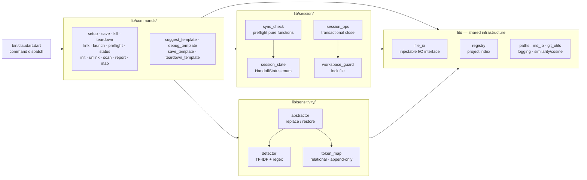

# claudart

A Dart CLI that brings structured memory, session state, and privacy to your Claude Code workflow.

> Not an Anthropic product. Built for Claude Code + Dart/Flutter projects.

---

## What is claudart?

**claudart** is a compiled Dart CLI — a binary you run in your terminal. It manages everything *between* Claude Code sessions: writing structured context before you open your editor, checkpointing discoveries mid-session, protecting sensitive identifiers before they leave your machine, and extracting learnings when a session ends.

**Claude Code** is the AI assistant built into your editor — VS Code, Cursor, or any IDE with Claude integration. You interact with it through slash commands in the chat panel: `/suggest` to explore a bug, `/debug` to implement a fix, `/save` to lock confirmed knowledge. It reads the context claudart wrote, so every session starts already knowing the bug, the declared scope, and what has been tried.

The two tools are completely separate. They communicate through a single shared file — `handoff.md` — that lives on your machine and is never sent to Anthropic until Claude reads it (abstracted first, if sensitivity mode is on).

| | claudart | Claude Code |
|---|---|---|
| **What it is** | Dart CLI — compiled binary at `~/bin/claudart` | AI assistant built into your editor |
| **Where you use it** | Terminal | IDE chat panel |
| **What you type** | `claudart setup`, `claudart teardown` | `/suggest`, `/debug`, `/save` |
| **What it manages** | Session state, workspace, skills, privacy | Codebase exploration, root cause, fix implementation |
| **Runs on** | Your machine only (`~/.claudart/`) | Anthropic servers — reads your abstracted context |
| **IDE examples** | — | VS Code · Cursor · any Claude-integrated editor |

---

## Quick start

```bash
# 1. Clone and compile
git clone https://github.com/liitx/claudart ~/dev/claudart
cd ~/dev/claudart
dart compile exe bin/claudart.dart -o ~/bin/claudart

# 2. Add ~/bin to PATH (if not already)
echo 'export PATH=$HOME/bin:$PATH' >> ~/.zshrc && source ~/.zshrc

# 3. Link your project
cd ~/dev/my-flutter-app
claudart link          # registers project, creates workspace, wires .claude symlink

# 4. Start a session
claudart setup
# → open your editor and type /suggest in the Claude Code chat panel
```

**Recompile after updates:**
```bash
dart compile exe ~/dev/claudart/bin/claudart.dart -o ~/bin/claudart
```

---

## How they work together

```mermaid
sequenceDiagram
    participant T as claudart CLI (your terminal)
    participant IDE as IDE (VS Code / Cursor)
    participant C as Claude Code
    participant H as handoff.md
    participant S as skills.md

    T->>H: claudart setup — writes bug · scope · branch
    Note over T,IDE: then open your editor
    IDE->>C: /suggest
    C-->>H: reads session context
    C-->>S: reads relevant past patterns
    C->>C: explores codebase within declared scope
    C->>H: writes root cause — status → ready-for-debug
    IDE->>C: /save
    C-->>H: reads handoff for checkpoint → archive/
    C->>S: deposits root cause to Pending
    IDE->>C: /debug
    C-->>H: preflight — status must be ready-for-debug ✓
    C->>H: writes status → debug-in-progress
    C->>C: implements scoped fix
    T-->>H: claudart teardown — reads · archives · resets
    T->>S: writes learnings — hot paths · patterns · anti-patterns
```



### claudart commands vs slash commands

| | Terminal — claudart | IDE chat panel — Claude Code |
|---|---|---|
| Start session | `claudart setup` | — |
| Explore & diagnose | — | `/suggest` |
| Checkpoint | `claudart save` | `/save` (same operation) |
| Implement fix | — | `/debug` |
| End session | `claudart teardown` | — |
| Check state | `claudart status` | — |
| Abandon session | `claudart kill` | — |
| Register project | `claudart link` | — |

> **`claudart` commands** run in your terminal. **`/suggest`, `/save`, `/debug`** are slash commands — type them in the Claude Code chat panel inside your editor.

---

## The workflow

| Step | Command | Run in | What happens |
|---|---|---|---|
| 1 | `claudart setup` | Terminal | Describe the bug. claudart writes a structured `handoff.md` |
| 2 | `/suggest` | Claude Code | Reads `handoff.md` + `skills.md`. Explores codebase. Confirms root cause. Sets status → `ready-for-debug` |
| 3 | `/save` | Claude Code | Checkpoints handoff to `archive/`. Deposits root cause to `skills.md → Pending`. Session stays open |
| 4 | `/debug` | Claude Code | Preflight check. Reads checkpointed handoff. Scoped fix — touches only what it declared |
| 5 | `claudart teardown` | Terminal | Prompts for learnings. Writes hot paths, patterns, anti-patterns to `skills.md`. Archives handoff. Suggests commit message |

`/save` is the required handshake between `/suggest` and `/debug`. It is the lock that prevents `/debug` from operating on stale or unconfirmed state.

> **Session state lives in `handoff.md` on disk — not in any terminal process.** After `claudart setup`, close that terminal. The session is unaffected. Continue from the integrated terminal inside your editor.

### Good and bad usage

| Scenario | ✓ Do this | ✗ Not this | Why |
|---|---|---|---|
| Moving from `/suggest` to `/debug` | Run `/save` first | Jump straight to `/debug` | Preflight blocks — status must be `ready-for-debug` and a checkpoint must exist |
| `/debug` hits a wall | Let Claude write `needs-suggest`, then run `/suggest` | Force debug to continue | `needs-suggest` is the explicit reverse-direction signal — it exists for this case |
| Branch switch mid-session | `claudart status` to check, proceed knowingly | Ignore the branch warning | Debug runs against the wrong session context |
| Session still open from yesterday | `claudart status` then continue or `claudart kill` | `claudart setup` over the top | Setup warns on active handoff and requires confirmation |
| Working on two projects | Each project has its own isolated workspace | Share one workspace | `~/.claudart/<project>/` — fully isolated per project |
| Sensitive class names in handoff | Enable sensitivity mode at `claudart link` | Manually redact | Abstraction is automatic and persistent — manual redaction drifts |

---

## Session state

The session has a typed status that both `/suggest` and `/debug` read and enforce. It is represented as the `HandoffStatus` enum in `session_state.dart`.

### Status transitions

| Status | Written by | Read / enforced by | What to do next |
|---|---|---|---|
| `suggest-investigating` | `claudart setup` | `/save` · `claudart status` · launcher | Run `/suggest` — root cause not yet confirmed |
| `ready-for-debug` | `/suggest` | preflight gate · `/save` · `claudart status` | Run `/save` to checkpoint, then `/debug` |
| `debug-in-progress` | `/debug` | preflight (allows resume) · `/save` | Continue or `/save` to checkpoint progress |
| `needs-suggest` | `/debug` on blocker | preflight (blocks new `/debug`) · `claudart status` | Run `/suggest` to resolve the blocker first |
| `unknown` | Parse fallback | `claudart status` · launcher | Run `claudart setup` — file is blank or corrupted |

### Why a typed enum

`HandoffStatus` is a Dart enum with an exhaustive `switch` in every command that reads the handoff. The Dart compiler rejects unhandled cases and catches typos at build time, not runtime. Adding a new status requires updating every switch or the build fails. The compiler is the cheapest enforcer of session state correctness — no tests needed to catch a misspelled string.

---

<details>
<summary><strong>Commands reference</strong></summary>

## Commands at a glance

| Command | What it does |
|---|---|
| `claudart` | Interactive launcher — lists projects, routes you in |
| `claudart init` | One-time workspace setup |
| `claudart init --project name` | Register a new project |
| `claudart link` | Wire workspace into current project via symlinks |
| `claudart setup` | Start a session — writes handoff.md |
| `claudart save` | Checkpoint session — snapshot handoff, deposit confirmed root cause to skills.md |
| `claudart kill` | Abandon session — archive handoff, remove symlink (no skills update) |
| `claudart preflight <op>` | Sync check before starting an operation (`debug` \| `save` \| `test`) |
| `claudart status` | Show current session state |
| `claudart teardown` | End session — update knowledge, archive, suggest commit |
| `claudart unlink` | Remove workspace symlinks from project |
| `claudart scan` | Re-scan project for sensitive tokens |
| `claudart map` | Generate a human-readable token map |
| `claudart report` | Show diagnostic summary |
| `claudart report --file-issue` | File issues to GitHub automatically |

</details>

---

<details>
<summary><strong>Skills &amp; the continuous improvement loop</strong></summary>

Every session makes the next one smarter. `skills.md` is the cross-session knowledge base — it accumulates from every session and is queried at the start of each new one.

```
Session ends
    ↓
claudart teardown prompts for learnings
    ↓                         ↓
Root Cause Patterns       Hot Paths · Anti-patterns
Branch Notes · Session Index
    ↓
Next session: /suggest reads relevant sections via cosine similarity
```

### skills.md structure

| Section | Written by | Read by | Content |
|---|---|---|---|
| `## Pending` | `claudart save` | `/suggest` | Confirmed root causes + hot file paths from in-progress sessions |
| `## Hot Paths` | `claudart teardown` | `/suggest` | Files confirmed key to past fixes |
| `## Root Cause Patterns` | `claudart teardown` | `/suggest` | What went wrong and how it was fixed, generically |
| `## Anti-patterns` | `claudart teardown` | `/suggest` | Files explored but not the root cause |
| `## Branch Notes` | `claudart teardown` | `/suggest` | Per-branch resolution log |
| `## Session Index` | `claudart teardown` | — | Flat log of all resolved sessions |

`claudart teardown` prompts you for learnings (category, hot files, cold files, pattern, fix pattern) and writes them directly to the relevant sections. It does not process or promote the `## Pending` section — that accumulates from `/save` as an in-session staging area.

`/suggest` does not read all of `skills.md`. It selects the top-3 most relevant sections using sparse TF-IDF cosine similarity against the current bug description. After 20 sessions, it surfaces 3 patterns, not 20.

</details>

---

<details>
<summary><strong>Privacy &amp; sensitivity protection</strong></summary>

When working on a proprietary codebase, class names, function signatures, and module structure may be confidential. claudart has an opt-in sensitivity mode.

### What gets abstracted

| Your code | What Claude sees |
|---|---|
| `AudioBloc` | `Bloc:A` |
| `AudioState` | `BlocState:A` |
| `AudioRepository` | `Repository:A` |
| `fetchTrack(String id)` | `[Method:A]([Param:A])` |

### What is never abstracted

Flutter and Dart framework vocabulary — `Bloc`, `Cubit`, `Provider`, `BuildContext`, `StreamSubscription`, `StatelessWidget`, standard architectural pattern names — is never abstracted. Only project-specific identifiers are candidates. The safe list uses TF-IDF rarity scoring against a bundled Dart/Flutter corpus: common framework terms score low (safe), project-specific identifiers score high (abstract).

### When abstraction happens

```
claudart setup
  ↓  scans changed Dart files (if sensitivity mode on)
  ↓  builds / updates token_map.json
  ↓  abstracts handoff.md content before writing to disk
────────────────────────────────── ← Anthropic API boundary
  ↓  Claude Code reads abstracted handoff.md
```

**KT writes are also protected.** When `/save` deposits the confirmed root cause to `skills.md → Pending`, it passes through the same abstractor first. Sensitive identifiers never appear in `skills.md` in plaintext.

**To enable:**
```
claudart link
→ Enable sensitivity mode? y
```

**Local reference — `claudart map`** generates a human-readable cross-reference so you can always map abstract tokens back to real names:

```markdown
## Blocs
| Token  | Event       | State       | Dependencies |
|--------|-------------|-------------|--------------|
| Bloc:A | BlocEvent:A | BlocState:A | Repository:A |
```

The token map is append-only. Once `AudioBloc → Bloc:A`, that mapping is permanent. Renamed class: `renamedTo` field added. Deleted class: `deprecated: true`. Tokens are never reused for different classes. Anthropic's understanding of `Bloc:A` accumulates correctly across every session.

</details>

---

<details>
<summary><strong>Git, PR &amp; test curation</strong></summary>

### Workspace isolation

Each user's workspace (`~/.claudart/<project>/`) is fully isolated and lives outside all git repositories — git never touches workspace files. Multiple projects on the same machine each have their own workspace. Workspace files are never committed.

### Contributing to claudart

Users interact with claudart's output (their workspace), not its source. Changing claudart itself requires a PR:

```
fork liitx/claudart
  → feature branch (e.g. feature/my-change)
  → open PR
  → CI: dart test --test-randomize-ordering-seed=random
  → review + merge
```

The gate is controlled. Workspace changes never become PRs — only source changes do.

### Feedback loop

```
User hits a bug
  → claudart report --file-issue
  → files GitHub issue on liitx/claudart
  → reviewed and triaged by maintainer
```

### Test enforcement

Feature tests live in `test/commands/`, `test/session/`, `test/sensitivity/`. Each module has a `test_<module>.md` file documenting scope, owned behaviors, and coverage gaps.

`readme_sync_test.dart` enforces documentation accuracy automatically:

| What it checks | How |
|---|---|
| Every `HandoffStatus` value has a Glossary entry | Reads enum values from source, checks README |
| Every "Used by" file exists on disk | Parses Glossary, checks `lib/` |
| Every string value in Glossary matches `.value` getter | Cross-checks README strings vs enum source |
| Every file in Architecture section exists in `lib/` or `bin/` | Extracts basenames, checks disk |
| Every command in Commands table is dispatched in `bin/claudart.dart` | Parses README table, checks dispatch switch |

Run `/readme` in Claude Code after any feature change to sync documentation automatically.

</details>

---

<details>
<summary><strong>Glossary</strong></summary>

> The Glossary documents the precise vocabulary used in code, docs, and tests. The [readme sync test](test/readme_sync_test.dart) verifies 1:1 correspondence: every `HandoffStatus` enum value must have an entry, every "Used by" file must exist on disk, every string value must match the `.value` getter. Run `/readme` to sync after any feature change.

---

### `HandoffStatus`

The typed representation of a session's current state. Owned by `lib/session/session_state.dart`. Replaces all magic string comparisons — every command that reads the handoff switches exhaustively on this enum. The Dart compiler enforces that all values are handled and catches typos at build time, not at runtime.

**Values:** `suggestInvestigating` · `readyForDebug` · `debugInProgress` · `needsSuggest` · `unknown`

Commands that read handoff status: `save.dart`, `status.dart`, `launch.dart`, `sync_check.dart`
Commands that never read handoff status: `setup.dart`, `kill.dart`, `link.dart`, `init.dart`, `unlink.dart`, `scan.dart`, `map_cmd.dart`, `report.dart`

---

#### `HandoffStatus.suggestInvestigating`

> `/suggest` is actively exploring. Root cause not yet confirmed.

**String value:** `suggest-investigating`
**Used by:** `save.dart` · `status.dart` · `launch.dart`
**Not used by:** `sync_check.dart` (no preflight check for this value), `setup.dart`, `kill.dart`

**Example — handoff.md:**
```
## Status
suggest-investigating
```

**Rule:** `/save` skips the `skills.md` Pending entry when status is `suggestInvestigating` — root cause is not yet confirmed so there is nothing to checkpoint. The archive snapshot is still written.
**Cannot change:** The string `suggest-investigating` is written verbatim to `handoff.md` and every archive snapshot. Renaming it silently breaks all existing sessions.

---

#### `HandoffStatus.readyForDebug`

> `/suggest` has identified a root cause. Run `/save` to lock it, then `/debug` to implement the fix.

**String value:** `ready-for-debug`
**Used by:** `sync_check.dart` · `save.dart` · `status.dart` · `launch.dart`
**Not used by:** `setup.dart`, `kill.dart`, `link.dart`, `init.dart`

**Example — handoff.md:**
```
## Status
ready-for-debug
```

**Rule:** `sync_check.dart` (via `preflight_cmd.dart`) blocks `/debug` unless status is `readyForDebug` or `debugInProgress`. `/save` must be run between `/suggest` and `/debug` — it is the required handshake that locks the confirmed root cause into `skills.md → ## Pending`.
**Cannot change:** The string `ready-for-debug` is the gate value in `checkHandoffStatus`. Renaming it without migrating all existing `handoff.md` files silently bypasses the debug preflight.

---

#### `HandoffStatus.debugInProgress`

> `/debug` has started implementing the fix. The session is mid-repair.

**String value:** `debug-in-progress`
**Used by:** `sync_check.dart` · `save.dart` · `status.dart` · `launch.dart`
**Not used by:** `setup.dart`, `kill.dart`, `link.dart`, `init.dart`

**Example — handoff.md:**
```
## Status
debug-in-progress
```

**Rule:** `sync_check.dart` allows `/debug` to resume when status is `debugInProgress` — it does not re-block if debug was already running. `/save` can be run mid-debug to checkpoint incremental progress.
**Cannot change:** The string `debug-in-progress` is written by the `/debug` slash command template. Renaming it without updating the template leaves sessions stuck at `unknown`.

---

#### `HandoffStatus.needsSuggest`

> `/debug` hit a blocker it cannot resolve. Broader exploration is needed before repair can continue.

**String value:** `needs-suggest`
**Used by:** `sync_check.dart` · `save.dart` · `status.dart` · `launch.dart`
**Not used by:** `setup.dart`, `kill.dart`, `link.dart`, `init.dart`

**Example — handoff.md:**
```
## Status
needs-suggest
```

**Rule:** `checkHandoffStatus` surfaces an error when `/debug` is attempted with `needsSuggest` status, directing the user back to `/suggest`. It is the only status where the workflow explicitly reverses direction.
**Cannot change:** The string `needs-suggest` is written by the `/debug` slash command template on blocker detection. Renaming it without updating the template silently drops the reverse-direction signal.

---

#### `HandoffStatus.unknown`

> Status field is missing, empty, or contains an unrecognised value. Treated as a fresh or corrupted session.

**String value:** _(none — this is the parse fallback for any unrecognised string)_
**Used by:** `session_state.dart` · `status.dart` · `save.dart` · `launch.dart`
**Not used by:** `sync_check.dart` (unknown is not a condition any preflight check distinguishes)

**Example — what triggers it:**
```
## Status
          ← blank, or any string not matching the four canonical values
```

**Rule:** `HandoffStatus.fromString` returns `unknown` for any input that does not match the four canonical strings — it never throws. Commands treat `unknown` as "needs setup": `status.dart` suggests running `claudart setup`, `launch.dart` shows the start-new-session menu.
**Cannot change:** `unknown` is a Dart-side sentinel, not a value the workflow writes intentionally. If it appears in a handoff, the file was manually edited or corrupted — it is a signal to run `claudart setup`, not a state to route on.

---

### Sensitivity abstraction choices

When sensitivity mode is on, claudart applies token abstraction at two points in the user flow:

1. **`claudart setup`** — scans changed Dart files, updates `token_map.json`, abstracts `handoff.md` content before writing to disk
2. **`/save`** — passes confirmed root cause content through the abstractor before depositing to `skills.md → Pending`

The abstraction is deterministic and relational: tokens preserve semantic relationships (`Extension:A on Bloc:A`), not just names. The token map is append-only — tokens are never reassigned or reused.

**Framework vocabulary is on the safe list.** Dart SDK, Flutter, BLoC, Riverpod, and standard architectural pattern names (`Bloc`, `Cubit`, `Repository`, `Provider`, `BuildContext`, etc.) are never abstracted regardless of rarity score. Only identifiers not in the framework corpus are candidates. The corpus will be expanded from ~100 terms to full Dart/Flutter framework coverage in a future update.

</details>

---

<details>
<summary><strong>Architecture</strong></summary>



```
bin/claudart.dart           ← entry point + command dispatch

lib/
  commands/
    init.dart               ← workspace + project initialization
    launch.dart             ← interactive launcher menu (registry-driven, phase-separated)
    link.dart               ← registry entry creation, symlinks, .gitignore, sensitivity mode
    unlink.dart             ← safe symlink removal
    setup.dart              ← session start, scan trigger, abstraction, logging
    save.dart               ← session checkpoint: snapshot handoff, deposit to skills.md Pending
    kill.dart               ← session abandon: archive + reset + unlink (no skills update)
    preflight_cmd.dart      ← preflight sync check CLI wrapper
    status.dart             ← display current handoff state
    teardown.dart           ← end session, update knowledge, archive
    scan.dart               ← on-demand project rescan
    report.dart             ← diagnostic bundle + GitHub issue filing
    map_cmd.dart            ← generate token_map.md
    suggest_template.dart   ← /suggest slash command definition (written to workspace)
    debug_template.dart     ← /debug slash command definition
    save_template.dart      ← /save slash command definition
    teardown_template.dart  ← /teardown slash command definition

  session/
    session_state.dart      ← immutable parsed view of handoff.md; owns HandoffStatus enum
    session_ops.dart        ← transactional session close with rollback
    workspace_guard.dart    ← lock file mechanism for interrupted state detection
    sync_check.dart         ← preflight pure functions: status, skills, branch, coverage gaps

  sensitivity/
    detector.dart           ← TF-IDF + regex sensitive token detection
    token_map.dart          ← persistent relational token map (load/save/assign)
    abstractor.dart         ← replace/restore sensitive tokens in text

  scanner/
    scanner.dart            ← Dart static analysis, entity extraction
    scan_threshold_exception.dart

  similarity/
    cosine.dart             ← sparse TF-IDF cosine similarity

  logging/
    logger.dart             ← interactions.jsonl, errors.jsonl, performance.md

  assets/
    corpus.dart             ← bundled IDF weights for safe Dart/Flutter terms

  config.dart               ← WorkspaceConfig read/write (config.json)
  ignore_rules.dart         ← .claudartignore pattern matching
  file_io.dart              ← abstract FileIO + RealFileIO (testability)
  git_utils.dart            ← detectGitContext(): root + branch in one git call
  process_runner.dart       ← abstract ProcessRunner + RealProcessRunner
  md_io.dart                ← markdown section read/write utilities
  handoff_template.dart     ← handoff.md template generator
  knowledge_templates.dart  ← starter knowledge content generators
  pubspec_utils.dart        ← SDK constraint extraction from pubspec.yaml
  teardown_utils.dart       ← pure utilities: extractBranch, extractSection, archiveName, etc.
  paths.dart                ← workspace path resolution + per-project path helpers
  registry.dart             ← immutable project registry (load/save/add/remove/touchSession)
```

**Key design patterns:**

- All file I/O goes through the `FileIO` interface — production uses `RealFileIO`, tests use `MemoryFileIO`
- All git calls go through `detectGitContext()` — one subprocess, root + branch together, no duplication
- Pure functions separated from side effects — `sync_check.dart`, `teardown_utils.dart`, `knowledge_templates.dart`, `md_io.dart` have no I/O side effects and are trivially testable
- Injectable parameters (`exitFn`, `confirmFn`, `pickFn`, `projectRootOverride`) on every command — prevents `exit()` from terminating the test process
- Transactional session close in `session_ops.dart` — archive → reset → unlink with full rollback on any step failure
- `HandoffStatus` enum — exhaustive switch enforcement catches unhandled statuses and typos at build time

**346 tests. Zero warnings on `dart pub publish --dry-run`.**

</details>

---

<details>
<summary><strong>Workspace structure — everything on disk</strong></summary>

```
~/.claudart/
  registry.json               ← index of all registered projects (name, root, workspace path)

  my-app/                     ← per-project workspace (created by claudart link)
    handoff.md                ← current session state (reset each teardown)
    skills.md                 ← cross-session index: pending, hot paths, root causes, anti-patterns
    archive/                  ← every past session + checkpoints, timestamped
    knowledge/
      generic/
        dart_flutter.md       ← generic Dart/Flutter best practices (version-tagged)
        bloc.md               ← BLoC patterns accumulated from real sessions
        riverpod.md           ← Riverpod patterns
        testing.md            ← testing patterns
      projects/
        my-app.md             ← project-specific context and accumulated patterns
    token_map.json            ← [sensitivity mode] persistent abstract token map
    config.json               ← per-workspace config (sensitivity mode, scan scope, etc.)
    logs/
      interactions.jsonl      ← per-command structured log (capped at 500 entries)
      errors.jsonl            ← error log with deduplication by fingerprint
      performance.md          ← scan timing and token counts
    .claude/
      commands/
        suggest.md            ← /suggest slash command definition
        debug.md              ← /debug slash command definition
        save.md               ← /save slash command definition
        teardown.md           ← /teardown slash command definition
```

The workspace is never inside a project. `claudart link` creates a `.claude` symlink from your project root to the workspace's `.claude/commands/` directory, making slash commands available in your editor.

</details>

---

<details>
<summary><strong>claudart link — registry-based project management</strong></summary>

`claudart link` does more than create symlinks. It:

1. Registers the project in `~/.claudart/registry.json` with name, project root, and workspace path
2. Creates an isolated workspace at `~/.claudart/<project-name>/`
3. Wires `.claude` symlink from project root to workspace commands directory — **skipped gracefully if `.claude/` already exists as a real directory** (e.g. when linking claudart to itself)
4. Writes `suggest.md`, `debug.md`, and `save.md` slash command templates to the workspace — always, regardless of symlink state
5. Auto-adds `.claude` to `.gitignore` when a symlink is created (skipped when `.claude/` is a real tracked directory)
6. Prompts for sensitivity mode — stored per-project in the registry

Re-linking an existing project updates the symlink and sensitivity mode while preserving the original `createdAt` timestamp and all existing workspace content.

</details>

---

<details>
<summary><strong>Preflight sync checks</strong></summary>

Before any operation that depends on the handoff, claudart runs a preflight check:

```
claudart preflight debug   ← run before /debug
claudart preflight save    ← run before /save
claudart preflight test    ← run before test suite (checks coverage maps too)
```

**1. Handoff status check**
For `debug`: handoff must be `ready-for-debug` or `debug-in-progress`. Any other status is an error.

**2. Skills sync check**
If a root cause is confirmed in the handoff, a matching entry must exist in `skills.md → ## Pending`. Missing entry means `/save` was skipped. Warning — does not block, but signals a missed checkpoint.

**3. Branch sync check**
Current git branch vs branch recorded in handoff header. Mismatch warns that you may be operating on the wrong session context.

**4. Coverage gap check** (test operation only)
Scans all `test_*.md` module files for coverage table rows marked `—`. Each declared gap is surfaced before the test run.

Preflight exits 0 for clean and warnings (workflow continues). Exits 1 for errors (workflow blocked).

</details>

---

<details>
<summary><strong>Sensitivity mode — token map internals</strong></summary>

**Detection: TF-IDF + regex**

Two layers decide what's sensitive:

1. **Regex heuristics** — `PascalCase` (class names), `camelCase` compound words (method names), `snake_case.dart` filenames
2. **TF-IDF rarity scoring** — project-specific identifiers don't appear in the bundled Dart/Flutter corpus, so they score high (abstract). Framework terms score low (safe).

**The token map is relational**

Tokens preserve semantic relationships:

```json
{
  "Bloc:A": { "r": "AudioBloc", "e": "BlocEvent:A", "s": "BlocState:A", "deps": ["Repository:A"] },
  "BlocState:A": { "r": "AudioState", "b": "Bloc:A" },
  "Extension:A": { "r": "AudioBlocX", "on": "Bloc:A" }
}
```

Claude sees `Extension:A on Bloc:A` — it can reason about the architecture without knowing the domain.

**Append-only, never reassigned.** Once `AudioBloc → Bloc:A`, permanent. Renamed class: `renamedTo` field. Deleted: `deprecated: true`. Never reused.

**The API boundary:**

```
Raw Dart identifiers (your machine only)
  ↓  static analysis + token map
  ↓  abstracted content
─────────────────────────── ← Anthropic API boundary
  ↓  Claude Code reads abstracted handoff.md
```

</details>

---

<details>
<summary><strong>Static analysis scanner</strong></summary>

Regex-based pattern matching — no full AST parser, kept light for performance.

| Pattern | Entity type | Token prefix |
|---|---|---|
| `class X extends Bloc<E, S>` | BLoC | `Bloc:` |
| `class X extends Cubit<S>` | Cubit | `Cubit:` |
| `class XState` / `sealed class XState` | BLoC state | `BlocState:` |
| `class XEvent` / `sealed class XEvent` | BLoC event | `BlocEvent:` |
| `class XRepository` | Repository | `Repository:` |
| `class X extends StatelessWidget` | Widget | `Widget:` |
| `extension X on Y` | Extension | `Extension:` |
| `typedef X = ...` | Callback/typedef | `Callback:` |
| `final xProvider = Provider(...)` | Riverpod provider | `Provider:` |
| `enum X { }` | Enum | `Enum:` |
| `mixin X` | Mixin | `Mixin:` |
| `class X` (unmatched) | Generic class | `Class:` |

**Threshold protection** — default 300 files. Exceeded: claudart warns, suggests narrowing to `lib/` or adding `.claudartignore`.

**`.claudartignore`** — place at project root. Default patterns: `**/*.g.dart`, `**/*.freezed.dart`, `**/*.mocks.dart`, `build/`, `.dart_tool/`.

**Incremental rescans** — only modified files are reprocessed. Full rescan: `claudart scan --full`.

</details>

---

<details>
<summary><strong>Logging &amp; diagnostics</strong></summary>

| File | Cap | Content |
|---|---|---|
| `logs/interactions.jsonl` | 500 entries | One JSON line per command run |
| `logs/errors.jsonl` | 200 entries | Errors with deduplication by fingerprint |
| `logs/performance.md` | 50 entries | Scan timing table |

Rotation is silent — oldest entries dropped at cap. `logs/summary.json` preserves aggregate counts.

**Error deduplication** — fingerprint: `"$command.$errorType.$reason"`. Same error increments `count` instead of creating a new entry.

**Sensitivity in logs** — token map applied to stack traces before writing. Real identifiers never appear in log files.

**`claudart report --file-issue`** — reads `errors.jsonl`, checks fingerprints against existing GitHub issues on `liitx/claudart`, files a new issue or comments on the existing one with updated frequency. Uses system `gh` CLI.

</details>

---

<details>
<summary><strong>Cosine similarity — how relevant skills are selected</strong></summary>

`skills.md` is not dumped into context wholesale. claudart selects the top-K most relevant chunks using sparse TF-IDF cosine similarity:

1. Tokenize the session's bug description into a query vector (TF-IDF weighted, bundled corpus)
2. Tokenize each section of `skills.md` into chunk vectors (same weighting)
3. Compute sparse dot product between query and each chunk
4. Return the top-3 chunks by cosine score

Sparse vectors only — 20–50 non-zero dimensions per chunk instead of 800. After 20 sessions, `/suggest` reads 3 patterns, not 20.

</details>

---

## Token efficiency

Unstructured Claude Code sessions are expensive. Every time you start fresh, the model re-reads dozens of files to rebuild context it already had. claudart eliminates that.

| Approach | Files read per session | Context reused |
|---|---|---|
| Unstructured (no handoff) | 30–60+ speculative reads | None |
| claudart structured session | ~5–15 targeted reads | Bug, root cause, scope, past patterns |

The first self-hosted claudart session (see [`experiments/`](experiments/)) resolved a real bug with **~15 total file reads** across `/suggest` + `/debug` combined.

---

## What's coming

claudart is actively developed and self-hosted — bugs and improvements are found by running the tool on itself. The [`experiments/`](experiments/) directory logs each self-hosted session.

Tracked on [GitHub Issues](https://github.com/liitx/claudart/issues). Current priorities:

**CLI experience**
- Arrow-key interactive menus across all commands (no more numbered picks)
- Spinners and progress indicators during operations
- Per-operation and total session timing in output
- Teardown confirmation table — review all extracted values before committing to skills.md

**Workflow**
- Framework-agnostic setup questions (remove Flutter/BLoC-specific wording)
- `claudart setup` false-positive "No project linked" fix when `.claude/` is a real directory
- `setup.dart` and `teardown.dart` full registry migration

**Public API**
- `lib/claudart.dart` barrel — public API surface with doc comments, orientating file for Claude Code agents and pub.dev

**Quality**
- GitHub Actions CI enforcing randomized test ordering on every PR
- Corpus expansion — full Dart/Flutter framework vocabulary as allow-list
- README auto-sync on every feature change via `/readme` skill + `readme_sync_test.dart`

---

## License

MIT
