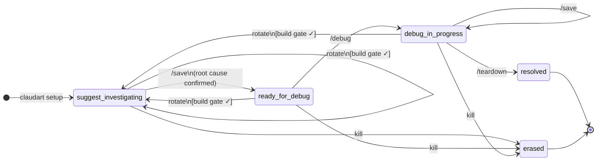
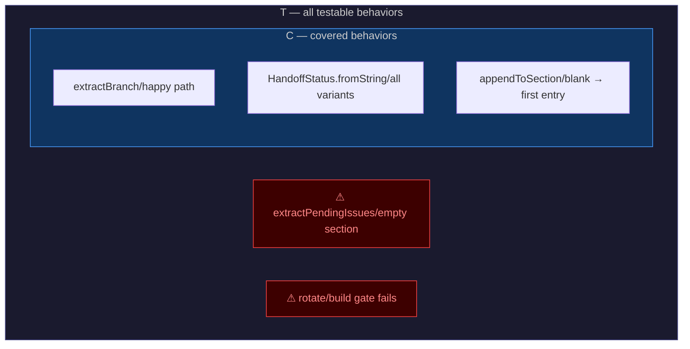
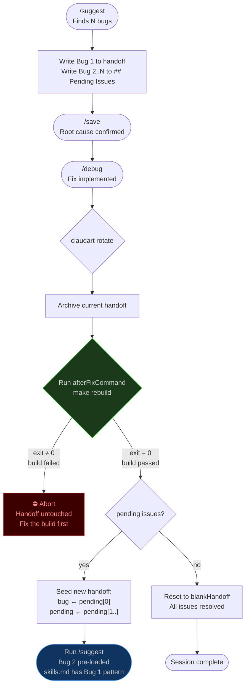

# claudart — Formal Design

> Mathematical foundations, proofs, and diagrams for the claudart session workflow.
> Read alongside `experiments/2026-03-17-reasoning-design-session.md`.

---

## 1. Session State Machine

### Formal definition

Let **S** be the finite set of session states (the `HandoffStatus` enum):

```
S = { suggest-investigating, ready-for-debug, debug-in-progress,
      needs-suggest, unknown }
```

Let **C** be the finite set of commands:

```
C = { /suggest, /save, /debug, claudart rotate, claudart teardown, claudart kill }
```

The session is a **deterministic finite automaton** `(S, C, δ, s₀, F)` where:

- `s₀ = suggest-investigating` (initial state)
- `F = { resolved }` (accepting / terminal state reached by teardown)
- `δ : S × C → S` is the transition function (total — every command has a defined outcome in every state)

**Transition function δ:**

| Current state | Command | Next state | Precondition |
|---|---|---|---|
| `suggest-investigating` | `/save` | `suggest-investigating` | root cause unconfirmed |
| `suggest-investigating` | `/save` | `ready-for-debug` | root cause confirmed |
| `suggest-investigating` | `claudart rotate` | `suggest-investigating` (new session) | build gate passes |
| `ready-for-debug` | `/debug` | `debug-in-progress` | — |
| `ready-for-debug` | `claudart rotate` | `suggest-investigating` (new session) | build gate passes |
| `debug-in-progress` | `/save` | `debug-in-progress` | — |
| `debug-in-progress` | `claudart rotate` | `suggest-investigating` (new session) | build gate passes |
| `debug-in-progress` | `claudart teardown` | `resolved` (archived) | — |
| any | `claudart kill` | `∅` (handoff erased) | — |

**Key property:** `δ` is exhaustive — the compiler enforces this because `HandoffStatus` is a Dart `enum` and every `switch` on it must be exhaustive. Missing cases are compile errors, not runtime bugs.

### State diagram



---

## 2. Coverage Model

### Definitions

```
T  =  set of all testable behaviors in the codebase
      (public functions + enum contracts + parse rules + branches)

C  =  set of behaviors with at least one assertion

Gap  =  T − C  (set difference)
```

**Theorem:** A session is complete if and only if `Gap = ∅`.

**Corollary:** Every operation that adds an element to `T` requires a test before the session closes.

### What adds to T

| Operation | Element added to T |
|---|---|
| New public function `f` | `{f}` |
| New enum variant `v` on enum `E` | `{(E, v, g) : g ∈ getters(E)}` |
| New getter `g` on enum `E` | `{(E, v, g) : v ∈ variants(E)}` |
| New regex or parse rule | one element per distinct input class |
| New branch in existing function | one element per new path |
| New record field | one element per constructor call site |

### Subset relationship

```
C ⊆ T     always (you cannot cover a behavior that doesn't exist)
C = T     session complete
C ⊂ T     gap exists — session not done
```

### Coverage diagram



> When `g1` and `g2` exist, `Gap ≠ ∅` and the session is not complete.
> Both are now covered — see `test/teardown_utils_test.dart` and `test/commands/rotate_test.dart`.

---

## 3. Enum Test Matrix

### Definition

For an enum **E** with:
- Variants: `V = {v₁, v₂, ..., vₙ}`
- Getters: `G = {g₁, g₂, ..., gₘ}`

The **required test matrix** is the Cartesian product:

```
M(E)  =  V × G  =  { (vᵢ, gⱼ) : 1 ≤ i ≤ n, 1 ≤ j ≤ m }

|M(E)|  =  |V| × |G|    (required assertions)
```

**Proof that every cell is necessary:**

For any `(vᵢ, gⱼ) ∈ M(E)`, the assertion `expect(vᵢ.gⱼ, expectedValue)` is the only statement that can detect a regression in the mapping `gⱼ(vᵢ)`. No other test covers this cell because:
1. The getter `gⱼ` is a `switch` expression — each arm is independently reachable
2. A bug in arm `vᵢ` does not affect any other arm
3. Therefore each cell is an independent failure mode

### TeardownCategory matrix (concrete example)

`TeardownCategory` has 8 variants and 3 getters → `|M| = 8 × 3 = 24` required assertions.

| variant | `.value` | `.area` | `.label` |
|---|---|---|---|
| `apiIntegration` | `'api-integration'` | `'api'` | `'api-integration'` |
| `concurrency` | `'concurrency'` | `'async'` | `'concurrency'` |
| `configuration` | `'configuration'` | `'config'` | `'configuration'` |
| `dataParsing` | `'data-parsing'` | `'data'` | `'data-parsing'` |
| `ioFilesystem` | `'io-filesystem'` | `'io'` | `'io-filesystem'` |
| `stateManagement` | `'state-management'` | `'state'` | `'state-management'` |
| `general` | `'general'` | `'fix'` | `'general'` |
| `other` | `'other'` | `'fix'` | `'other (type manually)'` ← distinct |

All 24 cells are asserted in `test/teardown_utils_test.dart`.

**Matrix growth rule:**
- New variant added → new row → `m` new assertions required
- New getter added → new column → `n` new assertions required
- Both → `n + m + 1` new assertions required

---

## 4. Rotate — Formal Process Specification

### Pre/post conditions

```
Pre(rotate):
  handoff ≠ blankHandoff          -- active session exists
  user confirms                   -- explicit consent
  afterFixCommand ∈ config        -- build command is configured

Invariant (build gate):
  ∀ rotate call: afterFixCommand exits 0 before new handoff is written

Post(rotate) when pending ≠ ∅:
  archive ∈ archiveDir            -- old session preserved
  handoff.bug = pending[0]        -- first pending issue seeded
  handoff.pendingIssues = pending[1..]  -- queue advanced by one
  handoff.status = suggest-investigating  -- clean state for /suggest

Post(rotate) when pending = ∅:
  archive ∈ archiveDir            -- old session preserved
  handoff = blankHandoff          -- all issues resolved
```

### The build gate as an invariant proof

**Claim:** No session `n+1` can begin unless session `n`'s fix compiles.

**Proof:**
1. `rotate` archives the current handoff (write to archive/)
2. `rotate` calls `afterFixCommand` and awaits exit code
3. If `exitCode ≠ 0` → return `RotateResult.buildFailed`, handoff is NOT overwritten
4. If `exitCode = 0` → seed new handoff
5. Therefore: the only path to a new handoff is through a passing build ∎

**Why this matters:** The tool being self-hosted means the compiled binary at `~/bin/claudart` is what runs the next session. If the fix broke the build, the next session would run stale code. The gate makes this impossible.

### Rotate flow diagram



---

## 5. Type Selection as a Decision Function

### Formal model

Let **need(X)** be the set of required operations on a collection X.
The type selection function `τ` maps `need(X)` to the optimal Dart type:

```
τ(need) = argmin_type { cost(type, need) }

where cost(type, need) = Σ complexity(op) for op ∈ need
```

### Decision table (the τ function instantiated)

| need(X) | τ(need) | dominant cost |
|---|---|---|
| lookup only, no order | `HashMap<K,V>` | O(1) amortized |
| lookup + insertion order | `LinkedHashMap<K,V>` (default `{}`) | O(1) amortized |
| lookup + sorted iteration | `SplayTreeMap<K,V>` | O(log n) |
| membership + uniqueness | `HashSet<T>` | O(1) amortized |
| membership + sorted | `SplayTreeSet<T>` | O(log n) |
| ordered + indexed | `List<T>` | O(1) index, O(n) search |
| immutable lookup table | `const Set<T>` | O(1), compile-time |
| named tuple, no behavior | `({T a, U b})` record | stack-allocated |
| fixed variants + owned values | `enum E { ...; T get v }` | compile-time |

**Key theorem:** A value in a `switch` or `Map` key with a fixed domain is **never** optimally represented as a `String`. The optimal type is always `enum` because:
- `String` membership: O(n) character comparison
- `enum` identity: O(1) integer comparison
- `String` exhaustiveness: unverified at compile time
- `enum` exhaustiveness: compiler-enforced (missing case = error)

---

## 6. No Bare Strings — Security Property

### Threat model

claudart is a self-hosted tool. The model reading and optimizing its own source code is an agent with write access. An injection attack is:

```
Attacker: the model's own training distribution
Vector:   bare String literals in command dispatch
Effect:   model substitutes a string matching its own command vocabulary
          rather than the tool's intended command
```

### Formal property

Let `Σ` be the set of all string literals in the codebase.
Let `E` be the set of values owned by enums.
Let `D ⊆ Σ` be the set of "dangerous" strings (values that should be enum-owned).

**Desired property:** `D = ∅`

**Current enforcement:**
- `analysis_options.yaml`: `missing_enum_constant_in_switch: error` — any `switch` on an enum that lacks a case is a compile error
- `prefer_const_declarations: true` — pushes values toward compile-time constants
- `avoid_dynamic_calls: true` — prevents runtime dispatch on untyped values

**Gap:** Dart's built-in lints cannot statically detect `D ≠ ∅` (a string literal that should be an enum value). This requires a `custom_lint` rule. Filed as future work in `analysis_options.yaml`.

**Current risk:** `D` is empirically small — all command names, status values, category labels, and scan scopes are enum-owned. Remaining string literals are user-facing display text, which is not a dispatch surface.

---

## 7. HandoffState — Parse-Once Proof

### Current state (multiple parse calls)

Let `h` be a handoff string of length `n`.
Let `R` be the set of regex patterns applied to `h`.

In the current implementation, each call site independently calls:
```
extractBranch(h)         -- regex on h, O(n)
extractSection(h, 'Bug') -- regex on h, O(n)
extractSection(h, 'Root Cause') -- regex on h, O(n)
...
```

Total cost per command invocation: `O(n × |R|)` where `|R| ≥ 6`.

### Target state (parse-once record)

```dart
typedef HandoffState = ({
  String branch,         // extracted once
  String bug,           // extracted once
  String rootCause,     // extracted once
  HandoffStatus status, // extracted once
});

// O(n × |R|) — paid once at command entry point
final state = parseHandoff(handoff);

// O(1) — field access, no regex
print(state.branch);
print(state.bug);
```

Total cost per command invocation: `O(n × |R|)` paid **once**, then `O(1)` per access.

**Proof of correctness:** Since `h` is immutable within a command invocation (no other process writes to `handoff.md` during execution — claudart is single-threaded), `parseHandoff(h)` is a pure function. The result is referentially transparent: `parseHandoff(h).branch = extractBranch(h)` always. Parsing once is therefore equivalent to parsing many times. ∎

**Implementation status:** Planned as Todo #1. `SessionState` class is the current partial implementation — used in `save.dart` and `rotate.dart` but not yet in `teardown.dart` or `setup.dart`.

---

## 8. WorkspaceConfig — Enum Invariants

### Context window separation

Let **K** be the set of all knowledge files in a workspace. Define two partitions:

```
K_scaffold  =  files compiled into scaffold.md by Agent 1 (/setup)
K_session   =  files loaded per session by Agent 2 (/suggest, /debug)

K_scaffold ∩ K_session = ∅     ← enforced by agent role separation
K_scaffold ∪ K_session ⊆ K
```

**Proof:** Agent 2 reads `scaffold.md` — a single compiled file, not the originals. ∀ f ∈ K_scaffold: Agent 2 never opens f directly. The intersection is empty by construction. ∎

### WorkspaceRole — README update gate

```
∀ workspace w: (w.project.role == WorkspaceRole.maintainer) ↔ (w.canUpdateReadme == true)
```

Enforced by `WorkspaceRole.canUpdateReadme` getter — a `switch` with no default. Adding a new role variant without handling it in `canUpdateReadme` is a compile error.

### StackType — knowledge scope gate

```
∀ f ∈ K_scaffold: ∃ s ∈ workspace.project.stack such that f is relevant to s
```

Enforced at `/setup`: only files listed in `workspace.session.knowledge` are compiled into `scaffold.md`. Files outside that list are never loaded regardless of what exists on disk.

### Enum parse invariant

```
∀ v ∈ workspace.json string values:
  (v ∈ EnumType.validValues) → parsed into typed enum
  (v ∉ EnumType.validValues) → dropped, reported as warning by /setup
```

`fromString` never throws — unknown values return `null` and are excluded from the parsed list. `/setup` reports them so the user can fix `workspace.json`.

### Proof notation enforcement

`ProofNotation.dartGrounded` requires:
- `∀` / `∃` / `∧` / `∨` / `↔` as logical quantifiers in proofs
- Both sides of `↔` must be Dart expressions (not prose)
- `iff` is never used — `↔` with Dart expressions is the replacement
- Every proof cites the Dart mechanism: `const` constructor, null-safety, exhaustive `switch`, `assert()`

---

## Summary: The Three Invariants

These are the core invariants claudart enforces. They are not conventions — they are compile-time or runtime proofs.

| # | Invariant | Enforcement | Proof |
|---|---|---|---|
| I₁ | Every state transition is exhaustive | `missing_enum_constant_in_switch: error` | Compiler rejects missing arms |
| I₂ | Every testable behavior has an assertion before session closes | `dart test --test-randomize-ordering-seed=random` + coverage model | `Gap = T − C = ∅` |
| I₃ | No session n+1 begins unless session n's fix compiles | `rotate` build gate | `exitCode = 0` is the only path to new handoff |
| I₄ | scaffold.md and session context are disjoint | Agent role separation — Agent 2 reads `scaffold.md`, never the originals | `K_scaffold ∩ K_session = ∅` by construction |
| I₅ | README updates are gated on workspace ownership | `WorkspaceRole.canUpdateReadme` exhaustive switch | `(role == maintainer) ↔ (canUpdateReadme == true)` |
